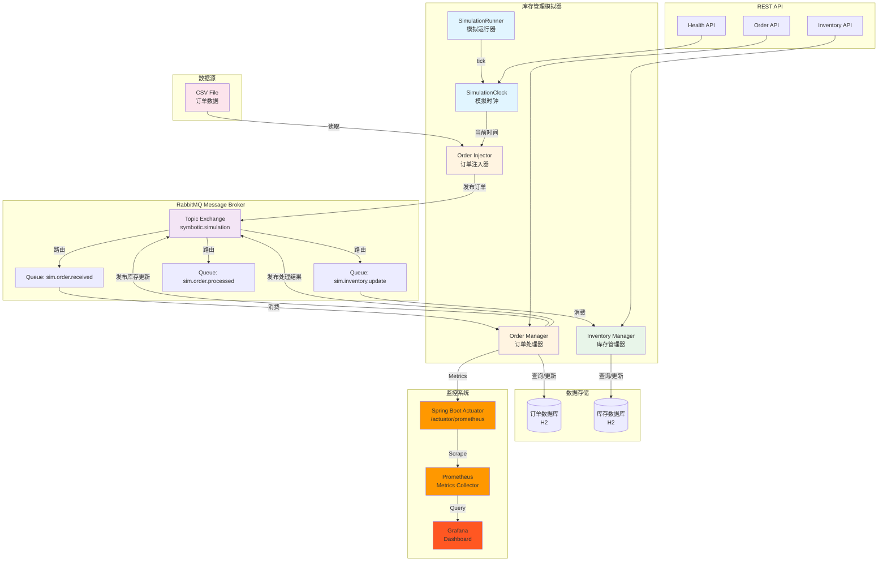
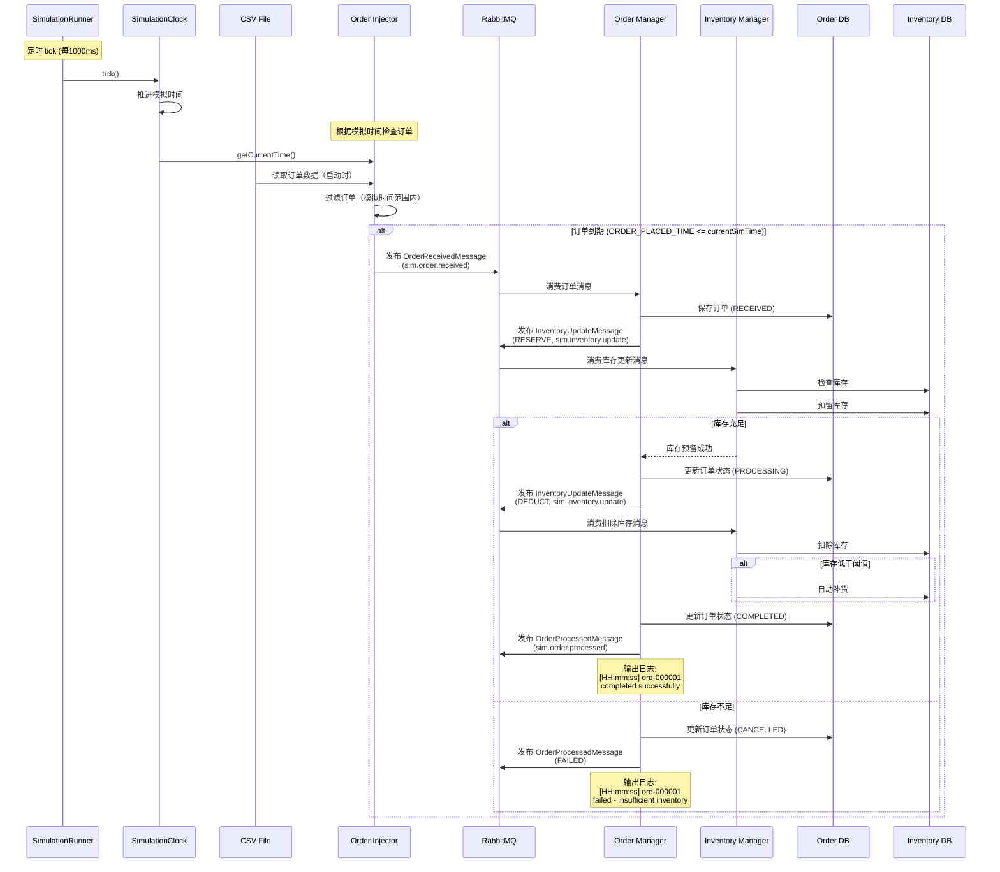
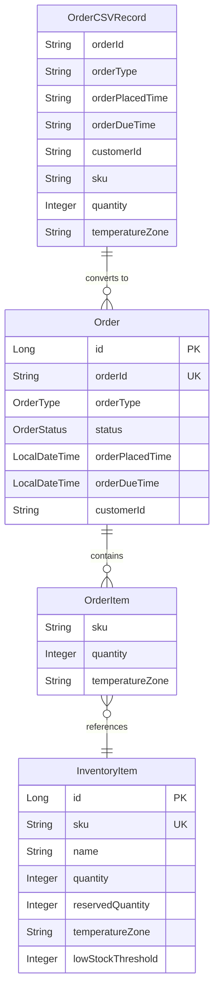
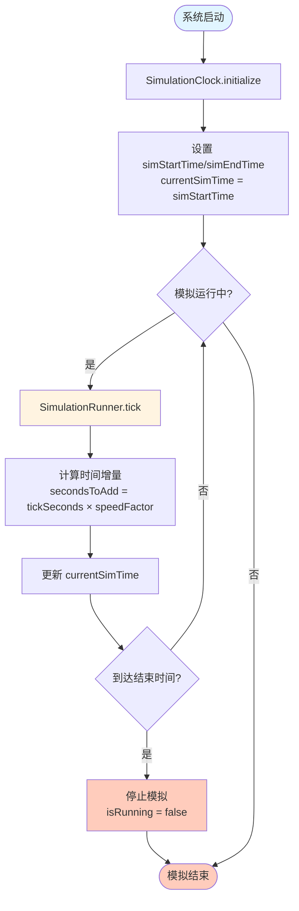
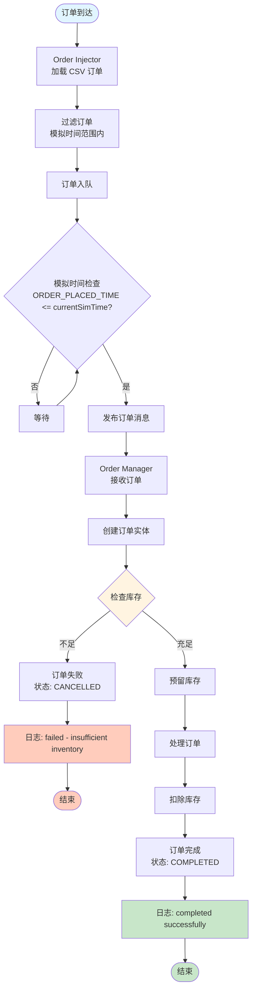
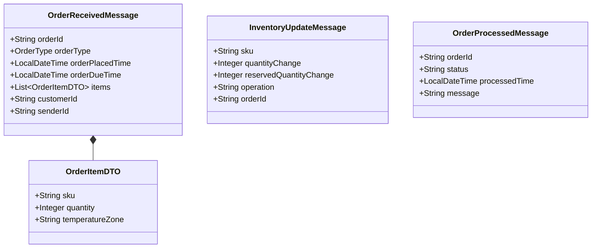
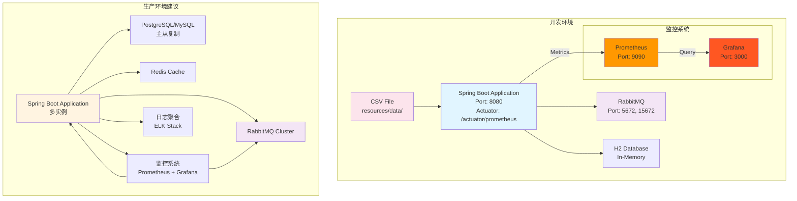

# 系统架构图

## 整体架构



## 消息流程图



## 组件交互图

```mermaid
graph LR
    subgraph "SimulationClock 组件"
        SC1[初始化<br/>simStartTime/simEndTime]
        SC2[Tick<br/>推进时间]
        SC3[获取当前时间<br/>getCurrentTime]
    end
    
    subgraph "Order Injector 组件"
        OI1[加载 CSV<br/>@PostConstruct]
        OI2[过滤订单<br/>模拟时间范围]
        OI3[检查订单时间<br/>ORDER_PLACED_TIME <= currentSimTime]
        OI4[发布订单]
    end
    
    subgraph "Order Manager 组件"
        OM1[监听订单消息<br/>@RabbitListener]
        OM2[创建订单实体]
        OM3[检查库存]
        OM4[处理订单]
        OM5[更新订单状态]
    end
    
    subgraph "Inventory Manager 组件"
        IM1[监听库存消息<br/>@RabbitListener]
        IM2[预留库存]
        IM3[扣除库存]
        IM4[自动补货]
    end
    
    SC1 --> SC2
    SC2 --> SC3
    SC3 --> OI3
    OI1 --> OI2
    OI2 --> OI3
    OI3 --> OI4
    OI4 --> OM1
    OM1 --> OM2
    OM2 --> OM3
    OM3 --> IM1
    IM1 --> IM2
    IM2 --> OM4
    OM4 --> IM1
    IM1 --> IM3
    IM3 --> IM4
    IM4 --> OM5
    
    style SC1 fill:#e1f5ff
    style SC2 fill:#e1f5ff
    style SC3 fill:#e1f5ff
    style OI1 fill:#fff4e1
    style OM1 fill:#fff4e1
    style IM1 fill:#e8f5e9
```

## 数据模型关系图



## 模拟时钟流程图



## 订单处理流程图



## 消息类型图



## 部署架构图



## 时间线图

```mermaid
gantt
    title 模拟时间线示例
    dateFormat HH:mm
    axisFormat %H:%M
    
    section 模拟时钟
    08:00 开始           :milestone, m1, 08:00, 0m
    08:00 - 18:00 运行    :active, sim, 08:00, 10h
    18:00 结束           :milestone, m2, 18:00, 0m
    
    section 订单处理
    ORD-000001 处理      :ord1, 08:00, 1m
    ORD-000002 处理      :ord2, 08:15, 1m
    ORD-000003 处理      :ord3, 09:00, 1m
    ORD-000004 处理      :ord4, 09:30, 1m
    ORD-000005 处理      :ord5, 10:00, 1m
```
