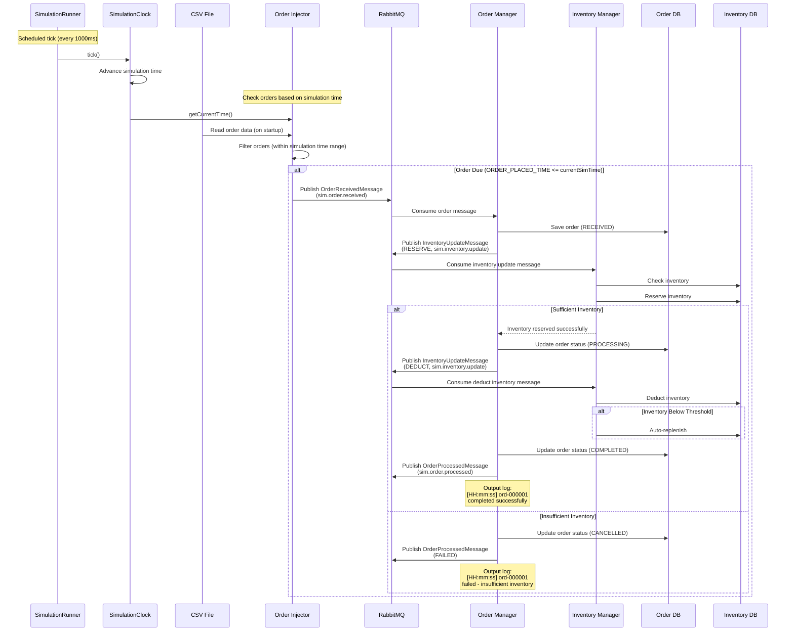

# System Architecture Diagrams

## Overall Architecture


## Message Flow Diagram



## Component Interaction Diagram


## Data Model Relationship Diagram


## Simulation Clock Flow Diagram

```mermaid
flowchart TD
    Start([System Startup]) --> Init[SimulationClock.initialize]
    Init --> SetTime[Set simStartTime/simEndTime<br/>currentSimTime = simStartTime]
    SetTime --> Running{Simulation Running?}
    
    Running -->|Yes| Tick[SimulationRunner.tick]
    Tick --> Calc[Calculate Time Increment<br/>secondsToAdd = tickSeconds × speedFactor]
    Calc --> Update[Update currentSimTime]
    Update --> Check{Reached End Time?}
    
    Check -->|No| Running
    Check -->|Yes| Stop[Stop Simulation<br/>isRunning = false]
    Stop --> End([Simulation End])
    
    Running -->|No| End
    
    style Start fill:#e1f5ff
    style End fill:#ffccbc
    style Tick fill:#fff4e1
    style Stop fill:#ffccbc
```



## Order Processing Flow Diagram


## Message Type Diagram


## Deployment Architecture Diagram


## Timeline Diagram

```mermaid
gantt
    title Simulation Timeline Example
    dateFormat HH:mm
    axisFormat %H:%M
    
    section Simulation Clock
    08:00 Start           :milestone, m1, 08:00, 0m
    08:00 - 18:00 Running    :active, sim, 08:00, 10h
    18:00 End           :milestone, m2, 18:00, 0m
    
    section Order Processing
    ORD-000001 Process      :ord1, 08:00, 1m
    ORD-000002 Process      :ord2, 08:15, 1m
    ORD-000003 Process      :ord3, 09:00, 1m
    ORD-000004 Process      :ord4, 09:30, 1m
    ORD-000005 Process      :ord5, 10:00, 1m
```
